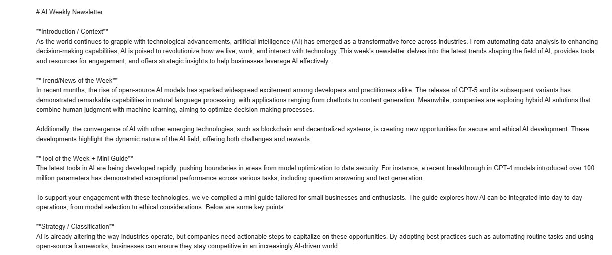

# AI Edge Weekly Newsletter Workflow

Welcome to the **AI Edge Weekly Newsletter Workflow**, an automated solution designed to create a personalized AI newsletter using manual text inputs and a local Ollama model. This repository contains an n8n workflow that aggregates user-provided content, summarizes it, structures it into a 7-section newsletter, and saves it as a Markdown file for manual import into Google Docs.

## Overview

This workflow is tailored for SMEs, startup founders, and non-technical professionals seeking actionable AI insights. It leverages a local Ollama DeepSeek-R1:1.5b model for summarization and structuring, ensuring a cost-free and customizable experience. The output is delivered as a Markdown file, which can be manually formatted and uploaded to Google Docs.

## Features

- **Manual Text Input**: Allows users to enter up to three independent text inputs for customization.
- **Automated Aggregation**: Combines inputs into a single cohesive text for processing.
- **AI-Powered Summarization**: Uses a local Ollama model to summarize content into 300 words.
- **Structured Newsletter**: Formats the summary into a 7-section newsletter (Introduction, Trend/News, Tool of the Week, Strategy, Tool Radar, CTA, Preview).
- **Markdown Output**: Saves the newsletter as `AI_Edge_Newsletter.md` for easy import into Google Docs.
- **Weekly Scheduling**: Triggers automatically on a weekly basis.

## Workflow


## Gmail Notifications



## Installation

1. **Clone the Repository**  
   ```bash
   git clone https://github.com/muhammadfarhantanvir/AI-Newsletter-n8n-automation.git
   cd ai-edge-newsletter
   ```

2. **Install n8n**  
   Follow the official [n8n installation guide](https://docs.n8n.io/getting-started/installation/) to set up n8n on your local machine.

3. **Set Up Ollama**  
   - Install Ollama from [Ollama's official site](https://ollama.ai/).
   - Pull the DeepSeek-R1:1.5b model:
     ```bash
     ollama pull deepseek-r1:1.5b
     ```
   - Run the Ollama server locally:
     ```bash
     ollama serve
     ```
   - Ensure it’s accessible at `http://localhost:11434`.

4. **Import the Workflow**  
   - Open n8n and go to the Workflows page.
   - Click "Import Workflow" and upload the `n8n_workflow.json` file from this repository.
   - Edit the `Text Input 1`, `Text Input 2`, and `Text Input 3` nodes to enter your manual text in the `value` fields.

## Usage


1. **Run the Workflow**  
   - Execute the workflow manually or wait for the scheduled trigger (set to weekly).
   - Check the execution log in n8n to ensure all nodes complete successfully.

2. **Retrieve the Output**  
   - After execution, find `AI_Edge_Newsletter.md` in your n8n working directory (e.g., `~/.n8n/` on Linux/Mac or `%USERPROFILE%\.n8n\` on Windows).
   - Open the file in a text editor, copy the content, and paste it into a new Google Doc at [Google Docs](https://docs.google.com).

3. **Format in Google Docs**  
   - Apply **Heading 1** for `#` (e.g., “AI Edge Weekly”).
   - Apply **Heading 2** for `##` (e.g., “Introduction / Context”).
   - Bold `**text**` and add links (e.g., `[replit.com]`) using the link tool.
   - Save and share the document.

## Differentiation

- **What makes this newsletter stand out**  
  AI Edge Weekly stands out by allowing readers to input custom content via three independent text fields, processed into a structured newsletter using a local Ollama model for a personalized, cost-free experience. Unlike broader newsletters like Ben’s Bites, it focuses on SME-specific insights and tools like Cursor, with automated Markdown output for Google Docs integration. Its user-driven approach ensures relevance to individual business needs, differentiating it from pre-curated content.

- **Target Group**  
  This newsletter is written for SMEs, startup founders, and non-technical professionals (e.g., marketers, product managers) seeking practical AI applications without deep technical expertise.

- **Concrete Added Value**  
  Readers receive a tailored AI newsletter based on their input, saving research time and enabling immediate implementation with tools like Cursor. The local Ollama model eliminates costs, while automated delivery to Google Docs enhances productivity for business planning.

## Reflection

- **What was challenging?**  
  I faced several errors in connecting Google Docs due to API issues, primarily because of the lack of authentication credentials, which complicated direct integration. Integrating the local Ollama model and aligning its output with the 7-section structure while maintaining Google Docs compatibility also posed difficulties due to these limitations.

- **What did i learn?**  
  I learned to use n8n’s `Function` node effectively to aggregate inputs dynamically and handle edge cases like empty fields. I also gained insight into optimizing local AI model prompts for structured outputs, enhancing my understanding of workflow automation without external APIs.


## Troubleshooting

- **Ollama Server**: Ensure Ollama is running at `http://localhost:11434` with DeepSeek-R1:1.5b. Test with: `curl -X POST http://localhost:11434/api/generate -d '{"model": "deepseek-r1:1.5b", "prompt": "Test"}'`.
- **n8n Compatibility**: Verify n8n supports all nodes (e.g., `n8n-nodes-base.function`, `n8n-nodes-base.httpRequest`). Update if needed.
- **Output Issues**: If `AI_Edge_Newsletter.md` is not generated, check the `Save to File` node’s output in n8n’s execution log.
- **Text Inputs**: Ensure all `Text Input` nodes contain text before running the workflow.

## Contributing

Feel free to fork this repository, submit issues, or propose enhancements. Contributions to improve input validation, error handling, or Google Docs integration are welcome!

## Acknowledgements

- Built with [n8n](https://n8n.io/) for workflow automation.
- Powered by [Ollama](https://ollama.ai/) for local AI processing.

---

